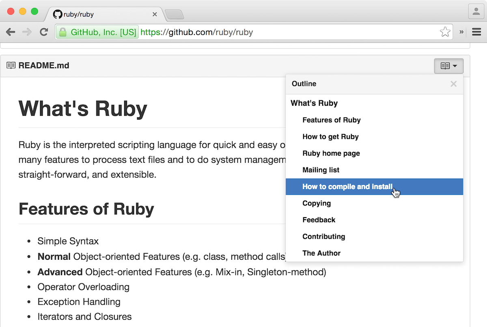

## GitHub - Readme Table of Contents

Adds a table of contents to GitHub Readmes, Wikis, and Gists.

🚀 **[Install userscript](https://github.com/arthurhammer/github-readme-toc/raw/master/dist/github-toc.user.js)** (does not work with Safari).

This is also available as a browser extension for Google Chrome and Firefox. The [code for userscript and extension lives here](https://github.com/arthurhammer/github-readme-toc).

