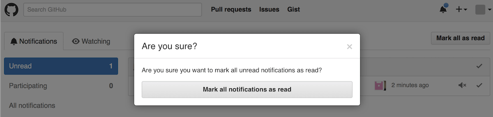

## GitHub - Skip Notification Confirmation

Skips the confirmation dialog when marking all notifications as read on GitHub.

🚀 **[Install userscript](https://github.com/arthurhammer/userscripts/raw/master/GitHub_SkipNotificationConfirmation/github_skip-notification-confirmation.user.js)** (does not work with Safari).

