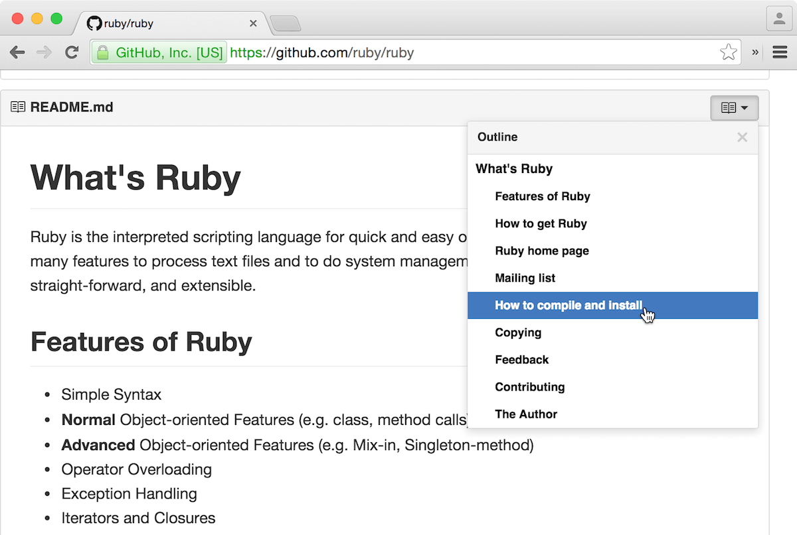

## GitHub - Table of Contents for GitHub

Adds a table of contents to GitHub readmes, wikis, and gists.

🚀 **[Install userscript](https://github.com/arthurhammer/github-toc/raw/master/dist/github-toc.user.js)**.

This is also available as a browser extension for Google Chrome, Firefox and Safari. The [code for userscript and extension lives here](https://github.com/arthurhammer/github-toc).

