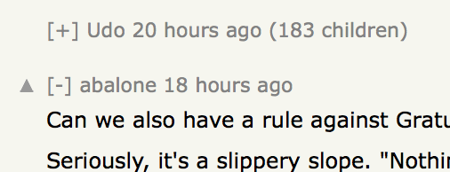

## Hacker News - Collapse Comments

**Deprecated**: Userscript is deprecated. This feature has finally been added natively to Hacker News.

---

Adds buttons to collapse and expand comment trees.

🚀 **[Install userscript](https://github.com/arthurhammer/hackernews-collapse/raw/master/hackernews-collapse.user.js)**.

This is also available as a browser extension for Safari. The [code for userscript and extension lives here](https://github.com/arthurhammer/hackernews-collapse).

