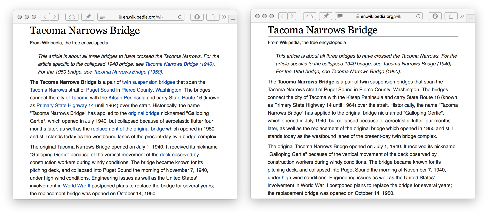

## Quiet Links

Mutes distracting links for focused reading.

Useful if you tend to fall into rabbit holes of clicking irrelevant links if you just wanted to read a single article. [Relevant XKCD](https://xkcd.com/214/).

🚀 **[Install userscript](https://github.com/arthurhammer/userscripts/raw/master/QuietLinks/quiet-links.user.js)**.

