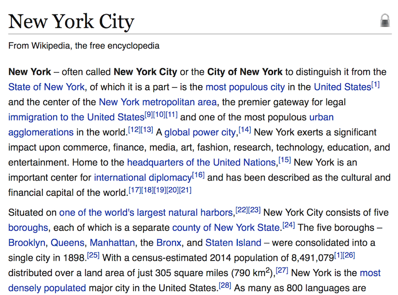
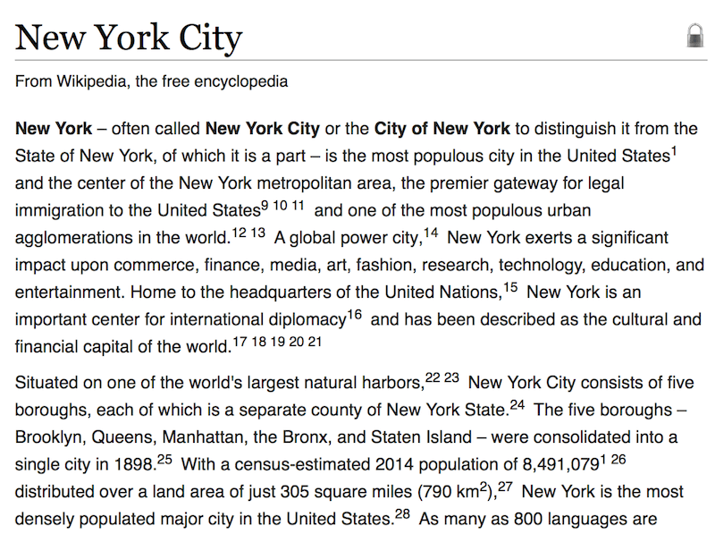

## Wikipedia - Quiet Wiki

Makes links stand out less in Wiki articles. Useful if you fall into rabbit holes when you just wanted to focus on a single article.

Individual options can be set in the script.

🚀 **[Install userscript](https://github.com/arthurhammer/userscripts/raw/master/Wikipedia_QuietWiki/wikipedia_quiet-wiki.user.js)**.

### Before

### After

