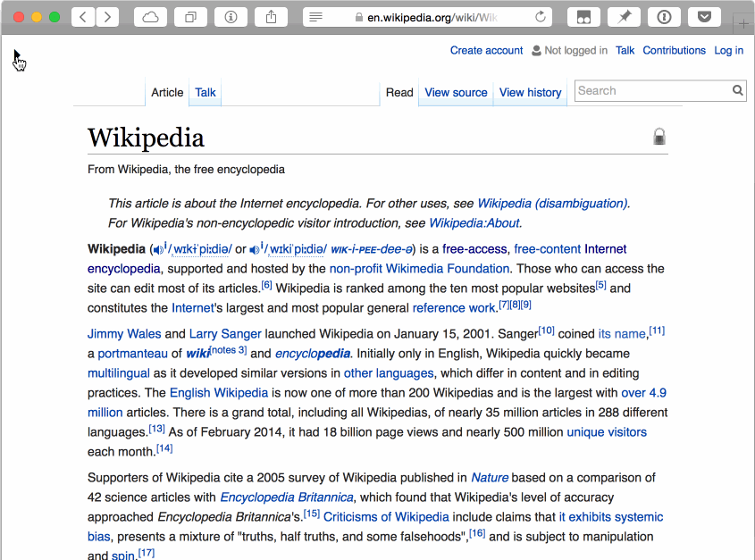

## Wikipedia - Toggle Sidebar

Adds a small button to hide or show the sidebar. Makes reading easier.

Sidebar is hidden by default.

🚀 **[Install userscript](https://github.com/arthurhammer/userscripts/raw/master/Wikipedia_ToggleSidebar/wikipedia_toggle-sidebar.user.js)**.

